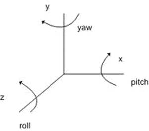

Control
=========

|

CreatePlacement
^^^^^^^^^^^^^^^^

Create object.

.. csv-table:: **Parameters**
    :header: Name, Required,Default, Description
    :widths: 10,10,10,70

    uid,Yes,,UserID
    bundleId,Yes,,Model ID
    parentId,No,"Current floor or park","Parent Object ID. 

    .. note::
        Only supports floor or park as parent

    "   
    parentUid,No,"Current floor or park","Parent Object UID. 
    
    .. note::
        Only supports floor or park as parent

    "
    transformProxyId,No,,"Reference Object ID, if specified, pos, rot and scl are relative to reference object"
    transformProxyUid,No,,"Reference Object UID, if specified, pos, rot and scl are relative to reference object"
    transformProxyFromBuffer,No,,"Reference Object from Buffer, if specified, pos, rot and scl are relative to reference object"
    pos,No,"``[0,0,0]``","Object Position

    .. note::
        if transformProxy is specified, pos is relative to transformProxy object, otherwise is relative to parent object."
    
    rot,No,"``[0,0,0]``", "
    Object rotation in 3-element tuple as Euler angles, use alternatively with quat, unit: degree.

    .. note:: 
        if transformProxy is specified, rot will based on transformProxy object coordinate, otherwise based on parent object.
    see :ref:`Euler Angles <euler-label>`"
    quat,No,"``[0,0,0,1]``","Object rotation specified by a 4-element tuple, use alternatively with ror.Any rotation can be determinate by a single axis with rotation angle. Give a axis (x, y, z) and a angle θ, rotation can be calculated as： 

    ``quat = [ x*sin(θ/2), y*sin(θ/2),z*sin(θ/2), cos(θ/2)]``

    .. note::
        if transformProxy is specified, rot will based on transformProxy object coordinate, otherwise based on parent object.
    "
    scl,No,"``[1,1,1]``","Scale Factor

    .. note::
        if transformProxy is specified, scale factor is relative to transformProxy object, otherwise is relative to parent object.
    "

**Example**

.. code-block:: json
    :linenos:

    {
        "cmd": "CreatePlacement", 
        "uid" : "object01",
        "bundleId":"F933B1A524B94050BC7A82B15D2057F5", 
        "transformProxyUid":"carbin01",
        "pos":[0,2,0],
        "rot":[0,90,0],
        "scl":[0.1,0.2,0,2]
    }

.. _euler-label:

**Euler Angles**

    Euler angles is essentially rotation against axis x,y and z while y is the vertical axis.

|

CreatePlacementFromChildren
^^^^^^^^^^^^^^^^^^^^^^^^^^^^^

Create object from model.

.. note::
    name conversion for object created by this method is ``{object uid}_{model name}``

.. csv-table:: **Parameters**
    :header: Name, Required, Description
    :widths: 20,10,70

    :ref:`Object Reference <api-object-label>`,Yes, Object Reference
    childNameList,Yes, Array of object names to be created from model
    toBuffer,No,uffer name which objects is saved to

**Example**

.. code-block:: json
    :linenos:

    {
        "cmd": "CreatePlacementFromChildren", 
        "uid": "silo",
        "childNameList": ["Window_01", "Window_02"], 
        "toBuffer": "window" 
    }

|

GetObjectsByCondition
^^^^^^^^^^^^^^^^^^^^^

Get objects by search criteria.

.. csv-table:: **Parameters**
    :header: Name, Required, Description
    :widths: 20,10,70

    condition,Yes,Search criteria
    fromBuffer,No,Specify buffer as search scope
    underLevelUid,No,"Specify parent object by uid, which will includes all children objects. Parent object must be floor or park."
    underLevelBuffer,No,"Specify parent object by buffer, which will includes all children objects. Parent object must be floor or park."
    toBuffer,No,Save search results to buffer

**Example**

.. code-block:: javascript
    :linenos:

    {
        "cmd": "GetObjectsByCondition", 
        
        //"_default_" condition always equals to true 
        //"condition": "_default_", 

        //search object by id or uid 
        //"condition": {"OBJECT":"4"}, 

        //search object by classId
        //"condition": {"CLASSID":3},    

        //search object by object property 
        //"condition": {"ATTRIBUTE":{"PropertyDict/Sex":"Male"}}, 

        //AND operator 
        //"condition": {"AND":[{"PropertyDict/sex":"Male"}, {"MoniterData/RealTimeData/Status":"Normal"}]}, 

        //OR operator
        //"condition": {"OR":[{"PropertyDict/sex":"Male"}, {"MoniterData/RealTimeData/Status":"Normal"}]}, 

        //NOT operator, can be used in conjunction with AND or OR
        //"condition": {"NOT":{"AND":[{"PropertyDict/Sex":"Male"}, {"MoniterData/RealTimeData/Status":"Normal"}]}}, 

        //////////////////////////
        //write search condition in brief mode
        //number, which is equivalent to  {"CLASSID":3}
        //"condition": 3, 

        //string, which is equivalent to {"OBJECT":"4"}
        //"condition": "4", 

        //key/value pair, which is equivalent to object property, e.g. {"ATTRIBUTE":{"PropertyDict/Sex":"Male"}}
        "condition": {"PropertyDict/Sex":"Male"}, 

        "toBuffer": "Man" 
    }

|

Show
^^^^^

Set object visibility.

.. csv-table:: **Parameters**
    :header: Name, Required, Description
    :widths: 20,10,70
    
    :ref:`Object Reference <api-object-label>`,Yes, Object Reference
    enable,Yes, ``True`` or ``False``

**Example**

.. code-block:: json
    :linenos:

    {
        "cmd": "Show", 
        "uid": "silo",
        "enable": false 
    }

|

SetPickEnable
^^^^^^^^^^^^^^

 Set whether object can be '**picked**'.

.. csv-table:: **Parameters**
    :header: Name, Required, Description
    :widths: 20,10,70
    
    :ref:`Object Reference <api-object-label>`,Yes, Object Reference
    enable,Yes, ``True`` or ``False``

.. code-block:: json
    :linenos:

    {
        "cmd": "SetPickEnable", 
        "uid": "silo",
        "enable": false 
    }

|

SetPosition
^^^^^^^^^^^^

Set object position.

.. csv-table:: **Parameters**
    :header: Name, Required, Description
    :widths: 20,10,70
    
    :ref:`Object Reference <api-object-label>`,Yes, Object Reference
    pos,Yes,"Coordinate, for instance，``[0,0,0]``

    .. note::
        Coordinate is relative to current floor or park
    "

**Example**

.. code-block:: json
    :linenos:

    {
        "cmd": "SetPosition", 
        "uid": "silo",
        "pos": [0,0,0] 
    }

|

SetScale
^^^^^^^^^^^^

Set object scale.

.. csv-table:: **Parameters**
    :header: Name, Required, Description
    :widths: 20,10,70
    
    :ref:`Object Reference <api-object-label>`,Yes, Object Reference
    scale,Yes,"scale value, for instance, ``[2,2,2]``"

**Example**

.. code-block:: json
    :linenos:

    {
        "cmd": "SetScale", 
        "uid": "silo",
        "scale": [1,2,1] 
    }

|

Sitdown
^^^^^^^^^^^^

Place object on the floor.

.. csv-table:: **Parameters**
    :header: Name, Required, Description
    :widths: 20,10,70
    
    :ref:`Object Reference <api-object-label>`,Yes, Object Reference

**Example**

.. code-block:: json
    :linenos:

    {
        "cmd": "Sitdown", 
        "uid": "chair_01"
    }

|

MoveTo
^^^^^^^^^^^^

Move object to given position with given speed.

.. csv-table:: **Parameters**
    :header: Name, Required, Default,Description
    :widths: 10,10,20,60
    
    :ref:`Object Reference <api-object-label>`,Yes,, Object Reference
    fromPos,No,current position,"Start position, relative to current floor or park"
    pos,Yes,"End position, relative to current floor or park"
    targetUid,No,,End position by object ID
    time,No,2,"Duration in seconds, use with 'speed' alternatively"
    speed,No,1,"Moving speed in meter per second, use with 'time' alternatively"
    delay,No,,delay in seconds
    easeType,No,linear, "Start and/or ending mode, click :ref:`here <ease-mode-label>` for list of ease modes" 
    loopType,No,none, "Repeat mode
    can be one of:

        * none: do not repeat
        * loop: repeat
        * pingPong: move from start to end , then move from end to start, repeat the process
    "
    orientToPath,No,,Align with moving direction
    autoCreate,No,,Create new object and move it
    autoCreate/enable,No,,"Sub parameter of autoCreate, valid if autoCreate is enabled"
    autoCreate/bundleId,No,,"Sub parameter of autoCreate，specify model ID while create new moving object, Valid if autoCreate is enabled"
    autoCreate/pos,No,,"Sub parameter of autoCreate: object position, relative to current floor or park. Valid if autoCreate is enabled"
    autoCreate/targetUid,No,,"Sub parameter of autoCreate，set coordinate of new object by existing object uid. Valid if autoCreate is enabled"
    autoCreate/props,No,,"Sub parameter of autoCreate，set properties of new object. Valid if autoCreate is enabled."
    

**Example**

.. code-block:: json
    :linenos:

    {
        "cmd": "MoveTo", 
        "uid": "object01",
        "pos": [1,0,1]
    }

.. code-block:: json
    :linenos:

    {
        "cmd": "MoveTo", 
        "uid": "object01",
        "pos": [1,0,1], 
        "time": 2.0,
        "delay": 2.0,
        "easeType": "easeInOutQuad"
    }

.. code-block:: json
    :linenos:

    {
        "cmd": "MoveTo", 
        "uid": "object01",
        "pos": [1,0,1], 
        "speed": 2.0,
        "delay": 2.0,
        "orientToPath": true,
        "loopType": "loop",
        "easeType": "linear",
        "autoCreate": {
            "enable": true,
            "bundleId":"0AF78802F2F64DB2AEF805CB78D57E07",
            "targetUid":"posObj01",
            "props":{
                "Plate":"A001"
            }
        }
    }

|

MovePath
^^^^^^^^^^^^

Set Move Path.

.. csv-table:: **Parameters**
    :header: Name, Required, Default,Description
    :widths: 10,10,20,60
    
    :ref:`Object Reference <api-object-label>`,Yes,, Object Reference
    pointPath,Yes,"A set of positions as moving path, relative to floor or park."
    objectPath,No,"A set of object uid as moving path"
    time,No,2,"Duration in seconds, use with 'speed' alternatively"
    speed,No,1,"Moving speed in meter per second, use with 'time' alternatively"
    delay,No,,delay in seconds
    easeType,No,linear, "Start and/or ending mode, click :ref:`here <ease-mode-label>` for list of ease modes" 
    loopType,No,none, "Repeat mode
    can be one of:

        * none: do not repeat
        * loop: repeat
        * pingPong: move from start to end , then move from end to start, repeat the process
    "
    orientToPath,No,,Align with moving direction
    autoCreate,No,,Create new object and move it
    autoCreate/enable,No,,"Sub parameter of autoCreate, valid if autoCreate is enabled"
    autoCreate/bundleId,No,,"Sub parameter of autoCreate，specify model ID while create new moving object, Valid if autoCreate is enabled"
    autoCreate/pos,No,,"Sub parameter of autoCreate: object position, relative to current floor or park. Valid if autoCreate is enabled"
    autoCreate/targetUid,No,,"Sub parameter of autoCreate，set coordinate of new object by existing object uid. Valid if autoCreate is enabled"
    autoCreate/props,No,,"Sub parameter of autoCreate，set properties of new object. Valid if autoCreate is enabled."
    

**Example**

.. code-block:: json
    :linenos:

    {
        "cmd": "MovePath", 
        "uid": "object01",
        "pointPath": [[1,0,1], [1,0,0], [12,0,0]]
    }

.. code-block:: json
    :linenos:

    {
        "cmd": "MovePath", 
        "uid": "object01",
        "objectPath": ["obj01", "obj02", "obj03"], 
        "time": 2.0,
        "delay": 2.0,
        "easeType": "easeInOutQuad"
    }

.. code-block:: json
    :linenos:

    {
        "cmd": "MovePath", 
        "uid": "object01",
        "objectPath": ["obj01", "obj02", "obj03"], 
        "speed": 2.0,
        "delay": 2.0,
        "orientToPath": true,
        "loopType": "loop",
        "easeType": "linear",
        "autoCreate": {
            "enable": true,
            "bundleId":"0AF78802F2F64DB2AEF805CB78D57E07",
            "targetUid":"posObj01",
            "props":{
                "Plate":"A001"
            }
        }
    }

|

Attach
^^^^^^^

Attach to object.

.. csv-table:: **Parameters**
    :header: Name, Required,Description
    :widths: 20,10,70
    
    :ref:`Object Reference <api-object-label>`,Yes,Object Reference
    targetId,No,Set target object by ID
    targetUid,No,Set target object by UID
    targetFromBuffer,No,Set target object from buffer
    pos,No,Offset to target object
    rot,No,Rotation relative to target object

**Example**

.. code-block:: json
    :linenos:

    {
        "cmd": "Attach", 
        "uid": "eyes",
        "targetUid": "head",
        "pos": [0,0.1,0],
        "rot": [0,90,0]
    }

|

Detach
^^^^^^^
    
Detach from object.

.. csv-table:: **Parameters**
    :header: Name, Required,Description
    :widths: 20,10,70
    
    :ref:`Object Reference <api-object-label>`,Yes,Object Reference

**Example**

.. code-block:: json
    :linenos:

    {
        "cmd": "Detach", 
        "uid": "eyes"
    }

|

AutoRotate
^^^^^^^^^^^^

Rotate object

.. csv-table:: **Parameters**
    :header: Name, Required, Default,Description
    :widths: 10,10,20,60
    
    :ref:`Object Reference <api-object-label>`,Yes,, Object Reference
    speed,No,180,Rotate speed by degree per second
    enable,No,``true``,Stop auto rotating if set to false

**Example**

* Start auto rotating

.. code-block:: json
    :linenos:

    {
        "cmd": "AutoRotate", 
        "fromBuffer": "fan"
    }

* Stop auto rotating

.. code-block:: json
    :linenos:

    {
        "cmd": "AutoRotate",
        "fromBuffer": "fan",
        "enable":false
    }

|

Rotate
^^^^^^^

Rotate object by a given angle.

.. csv-table:: **Parameters**
    :header: Name, Required, Default,Description
    :widths: 10,10,20,60
    
    :ref:`Object Reference <api-object-label>`,Yes,, Object Reference
    rot,No,," A 3-element array as rotation angle. unit = degree"
    space,No,self, "rotate against world or itself. Can be one of :

        * world: rotate against world.
        * self: rotate as itself. 
       
        "

**Example**

.. code-block:: json
    :linenos:

    {
        "cmd": "Rotate", 
        "fromBuffer": "fan",
        "rot":[0,90,0],
        "space":"self"
    }

|

Destroy
^^^^^^^^

Destroy object.

.. csv-table:: **Parameters**
    :header: Name, Required,Description
    :widths: 20,20,60

    :ref:`Object Reference <api-object-label>`,Yes, Object Reference

**Example**

.. code-block:: json
    :linenos:

    {
        "cmd": "Destroy", 
        "fromBuffer": "Trash"
    }

|

CreateTimerObject
^^^^^^^^^^^^^^^^^^

 Create timer object, can be used as data source, *invisible* in UI.

.. csv-table:: **Parameters**
    :header: Name, Required,Description
    :widths: 20,20,60

    toBuffer,Yes,  Buffer to store time object

**Example**

.. code-block:: json
    :linenos:

    {
        "cmd": "CreateTimerObject", 
        "toBuffer": "timer01"
    }

|

**Properties of timer object**
   
    .. csv-table:: **Properties of current time**
        :header: Name,Description
        :widths: 20,60

        YearMonthDay,return string as ``yyyy.MM.dd``
        HourMinuteSecond,return string as ``HH:mm:ss``
        HourMinuteSecondMillisecond,return string as ``HH:mm:ss:ffff``
        YearMonthDayHourMinuteSecond,return string as ``yyyy.MM.dd HH:mm:ss``
        Year,Year of YearMonthDayHourMinuteSecond
        Month,Month of YearMonthDayHourMinuteSecond
        Day,Day of YearMonthDayHourMinuteSecond
        Hour,Hour of YearMonthDayHourMinuteSecond
        Minute,Minute of YearMonthDayHourMinuteSecond
        Second,Second of YearMonthDayHourMinuteSecond
        Millisecond, Millisecond of HourMinuteSecondMillisecond
        DayOfYear,Day of year
        DayOfWeek,Day of week，[0-6] while 0 is Sunday

    .. csv-table:: **Properties of total running time**
        :header: Name, Description
        :widths: 20,60

        TimerYear,Year of total running time
        TimerAllYear,Same as TimerYear
        TimerMonth, Month mod year
        TimerAllMonth,Total month
        TimerDay,Day mod month
        TimerAllDay,Total day

